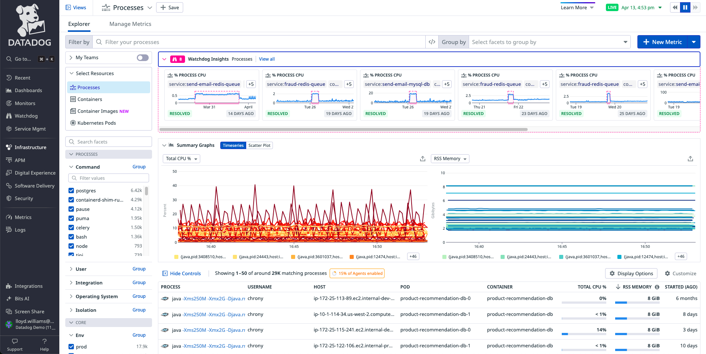
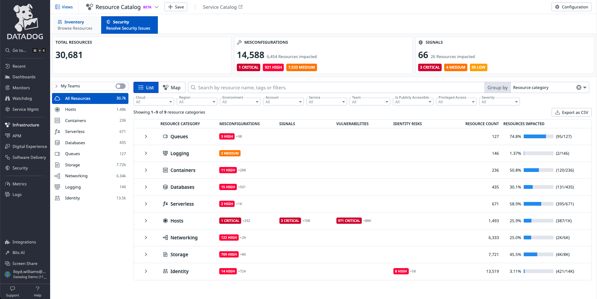

# DevSecOps Infra-CSM Demo

###### Introduction

[Just as your team is responsible for monitoring and proactively responding to discrepancies and issues in your infrastructure, we're increasingly seeing many DevOps teams becoming explicitly responsible for tackling security issues.](https://app.datadoghq.com/process?selectedTopGraph=timeseries) 

That's a difficult ask for teams new to security or have enough on their plates already, which is why we make that responsibility as intuitive as possible with our infrastructure and security correlation.

###### **Pivot into Infra Resource Catalog (list)**

[Here we can see a list of all your resources with the misconfigurations and threats highlighted at the top.](https://app.datadoghq.com/infrastructure/catalog?activePanel=resource-catalog-main-panel&fillBy=cspm&groupBy=resource_category&page=0&pageSize=50&sort=team&tab=security&viz=list) 

Below, we see all of our resources distributed by resource categories and associated threats and misconfigurations. 

This helps us determine where many of the issues are located. We can click into them and see the exact resource name, region and other details pinpointing the location. 

###### Pivot into Infra Resource (Map) fill by threats

The list view is great, but with a resource map, this provides us a bird eye’s view of all the information -- allowing us to quickly locate and investigate any issues. 

Think of this as the host map from a security context.

###### Click into a finding (hexagon)

I’m able to hop right into any resource that has an issue and begin investigating. 

From here, I’d like to go even further and understand what else could potentially be happening.

###### Click on a finding within the side panel

Right from infrastructure, I’m able to easily pivot into Cloud Security Management (CSM) and proceed with my analysis. 

###### Currently in CSM Security Signal 

Welcome to CSM! 

Here I can get deeper insights into malicious actions within my workloads and misconfigurations as well as compliance checks surrounding my cloud resources. 

We’re currently scoped to a security signal allowing you to further investigate this attack and correlate against the observability metrics.

###### Click into “Security Inbox”

With the amount of signals coming in, I’m sure you’d prefer a way to prioritize the most important security issues impacting your workloads. 

You can do just that with our security inbox. 

This cuts down the noise to help you manage different factors of risk.

###### Click into an “IAM Role” Critical Signal 

Right from here we can dive into an investigation with a description as to why this is an issue. 

We provide remediation steps on how to resolve this and pinpoint the resources that were impacted by this event. 

This provides us with all the context to understand the full scope of the security event.

###### Click into CSM Vulnerabilities -> click into a critical finding -> click into resource in the dropdown

Now let’s say we want deeper insights combining that infra observability with security insights. 

###### Now Pivot to CSM Vulnerabilities 

We can do exactly that with CSM Vulnerabilities. 

This continuously scans for vulnerabilities

	- within your container images and 
	- hosts within your infrastructure 

and provides you with a description of what happened -- so you’re not left in the dark -- and a window of exposure to understand how long this vulnerability was unpatched in your environment. 

Additionally, with our Datadog severity breakdown, we will analyze the resource and adjust the CVSS score to help you determine whether this needs to be remediated immediately or not. 

Once that’s been determined, you can follow the next steps to remediate this vulnerability and resolve the issue. 

###### Click into Identity Risk 

Now, pivoting into risk surrounding your IAM configurations within your cloud environment, Datadog **Cloud Infrastructure Entitlement Management**, also known as CIEM, enables you to identify and address - identity risks in your IAM configurations before a threat actor can exploit them.

Mismanagement of these permissions can cause breaches and insider threats. 

Therefore, getting ahead of this, reduces that potential of risk whilst leveraging identity best practices. 

###### Click into Compliance 

When there’s a lack of visibility within infrastructure, it most likely will be the same with compliance. 

And so, with our compliance overview, we’re breaking down those siloes and enabling visibility. 

Here we can detect misconfigurations around your resources and evaluate your environment against a variety of frameworks. 

The posture scores help you determine how compliant you are against those benchmarks. 

Additionally, it’s easy to share this information within your applicable teams or auditors for evidence during an evaluation.

###### Click into SOC 2 Framework -> click into any critical/high finding

Lets take for example SOC 2. 

We can dive into our findings and we’re provided with a description and rationale as seen earlier in our demo as well as the remediation steps.

###### Click into one of “resources impacted”

But I’d like to gather deeper insights into the resources that were impacted.

###### Click into resource 

From here, I can obtain the resource type with its ID. 

With our relationships view, we can get insights on where the resource exists and what it is communicating with. 

But I’m also able to triage my findings and: 

	- kick off a workflow, 
	- pivot into my AWS account and view it there, 
	- or I can mute the findings to cut down the noise. 

All accomplished within this single pane, thus cutting down time to detection and resolution.

###### CSM Overview  

Finally, with our CSM overview, you get a bird eye’s view of everything from: 

	- your threats, 
	- misconfiguration, 
	- vulnerabilities and compliance posture score, 

to help enable broad coverage of your resources from a security perspective and dive back into investigation wherever you'd like -- bridging the gap between siloes across your infrastructure and associated security insights.